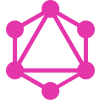

# Hello! 👋 Who am I?
- 🔭 Blockchain developer with 4.5+ years of experience | DeFi, DEX, DApps 
- 🌱 Go · Python · JavaScript · TypeScript · Solidity · Node.js · gRPC  
- 👍 Cosmos · CometBFT · Tendermint · Layer-2 · zk-Rollup · zk-SNARKs · zk-Circuit 
- ☁️ Cloud & DevOps –  AWS · Docker · GitHub  
- 🗄 Databases – PostgreSQL  · MongoDB   
- 📊 Tools & APIs – Grafana · GraphQL · SwaggerJS · Express · Streamlit 

<!-- Tech icons -->
## Tech Stack

  
  
  
  

  
  
  
  
  

  
  
  
  

  
  
  

